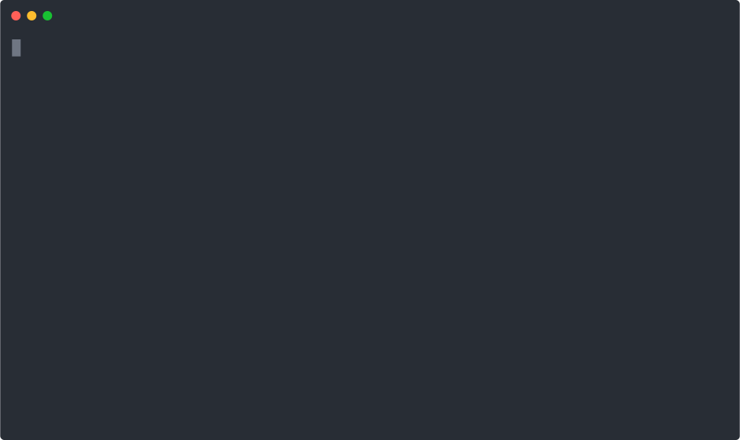

## Introduction

[](https://github.com/elliotxx/mdfmt/releases)
[](https://github.com/elliotxx/mdfmt/releases)
[](https://github.com/elliotxx/mdfmt/blob/master/LICENSE)
[](https://pkg.go.dev/github.com/elliotxx/mdfmt)
[](https://coveralls.io/github/elliotxx/mdfmt)

> 💡 A Markdown formatter that follow the CommonMark. Like gofmt, but for Markdown.

<p align="center">
  
</p>

## 📜️ Language

[English](https://github.com/elliotxx/mdfmt/blob/master/README.md) | [简体中文](https://github.com/elliotxx/mdfmt/blob/master/README-zh.md)

## ✨ Features

* **Support multiple inputs**: standard input, file, directory and wildcard. The specified directory will recursively format all markdown files under the directory
* **Support Rewriting**: write the results to (source) files instead of standard output
* **Support display difference**: display the difference before and after markdown formatting, Instead of rewriting files
* **Support listing formatted files**
* **Cross platform**: Linux, windows, Mac
* **One-click installation**: support one-click installation `mdfmt` through `Homebrew`, `go install`, etc.

## 🛠️ Installation

### Binary (Cross-platform: windows, linux, mac ...)

To get the binary just download the latest release for your OS/Arch from the [release page](https://github.com/elliotxx/mdfmt/releases) and put the binary somewhere convenient.

### Homebrew

The `elliotxx/tap` has macOS and GNU/Linux pre-built binaries available:

```
brew install elliotxx/tap/mdfmt
```

### Build from Source

Starting with Go 1.17, you can install `mdfmt` from source using go install:

```
go install github.com/elliotxx/mdfmt/cmd/mdfmt@latest
```

*NOTE*: This will install `mdfmt` based on the latest available code base. Even though the goal is that the latest commit on the main branch should always be a stable and usable version, this is not the recommended way to install and use `mdfmt`. The version output will show `mdfmt` version (default-version) for go install based builds.

### Docker

Docker users can use the following commands to pull the latest image of the `mdfmt`:

```
docker pull elliotxx/mdfmt
```

Verification:

```bash
$ docker run --rm elliotxx/mdfmt:latest mdfmt -h
...
$ docker run --rm elliotxx/mdfmt:latest mdfmt -V
...
$ docker run -v $PWD:$PWD --rm elliotxx/mdfmt:latest mdfmt -d /Users/yym/workspace/mdfmt/pkg/md/testdata/hello-more.md
diff -u /Users/yym/workspace/mdfmt/pkg/md/testdata/hello-more.md.orig /Users/yym/workspace/mdfmt/pkg/md/testdata/hello-more.md
--- /Users/yym/workspace/mdfmt/pkg/md/testdata/hello-more.md.orig
+++ /Users/yym/workspace/mdfmt/pkg/md/testdata/hello-more.md
@@ -1,6 +1,7 @@
 # hello
+
 > hello

-|name|age|
-|--|--|
-|Mike|18|
+| name | age |
+| ---- | --- |
+| Mike | 18  |
```

## ⚡ Usage

```
$ mdfmt -h
A Markdown formatter that follow the CommonMark. Like gofmt, but for Markdown.

Usage:
  mdfmt [flags] [path ...]

Examples:
  # Format specified Markdown file, and write to stdout
  mdfmt README.md
  
  # Format and rewrite for specified Markdown file
  mdfmt -w README.md
  
  # Display diffs instead of rewriting Markdown files
  mdfmt -d README.md
  
  # List files whose formatting differs from mdfmt's
  mdfmt -l .
  
  # Format, rewrite, and display diffs for specified Markdown file
  mdfmt -d -w README.md
  
  # Format and rewrite all Markdown file in current directory
  mdfmt -w *.md
  
  # Recursive format and rewrite all Markdown file in current directory
  mdfmt -w .
  
  # Format and rewrite the specified Markdown file and directory
  mdfmt -w README.md testdir/
  
  # Format stdin to stdout
  cat README.md | mdfmt
  
  # Show version info
  mdfmt -V

Flags:
  -d, --diff      display diffs instead of rewriting files
  -h, --help      help for mdfmt
  -l, --list      list files whose formatting differs from mdfmt's
  -V, --version   show version info
  -w, --write     write result to (source) file instead of stdout
```

## 🙏 Thanks

* The CLI Template uses [elliotxx/go-cli-prototype](https://github.com/elliotxx/go-cli-prototype)
* The specification follows [GFM](https://github.github.com/gfm/)/[CommonMark](https://commonmark.org/)
* The Markdown engine uses [lute](https://github.com/88250/lute), cool!
